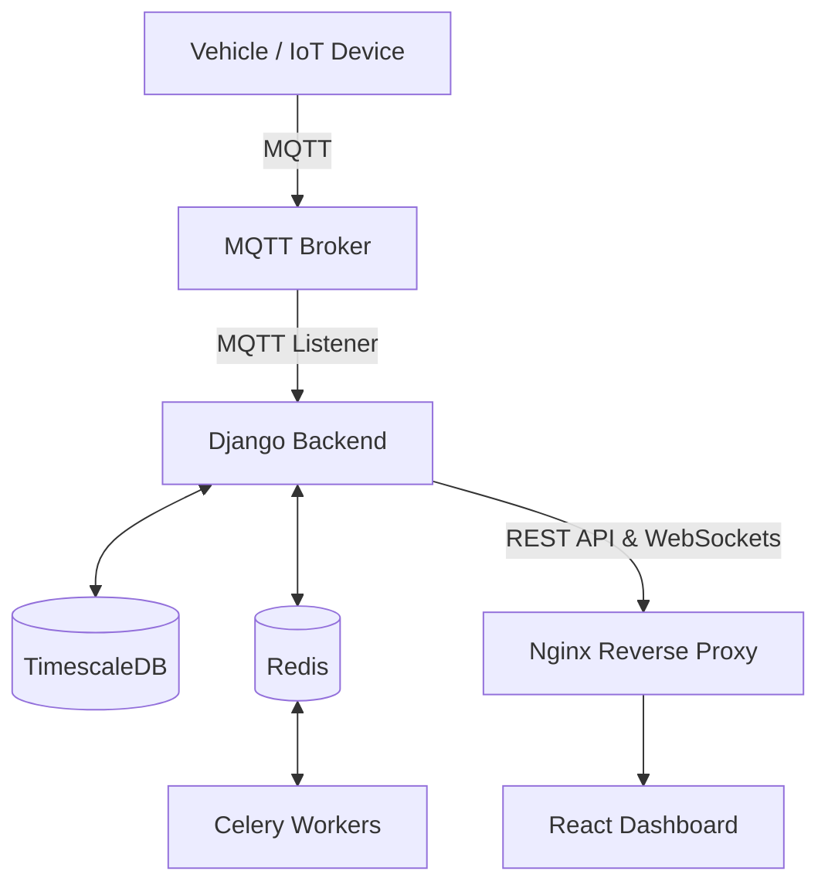

# Connected Auto Dashboard

A full-stack EV telematics and IoT fleet management platform.

## Overview

The Connected Auto Dashboard provides real-time monitoring, fleet management, and remote control for electric vehicles. It ingests high-frequency telemetry data via MQTT, processes it through a Django/TimescaleDB backend, and serves live insights to a React dashboard using WebSockets and REST APIs.

## Key Features

- **Live Telemetry & Tracking**: Real-time vehicle location, BMS (Battery Management System), and MCU metrics.
- **Remote Vehicle Control**: Lock/unlock immobilizer, sound horn, and execute MQTT commands.
- **Fleet & Dealer Management**: Multi-tenant architecture for assigning vehicles to fleets and managing dealer inventory.
- **Role-Based Access Control (RBAC)**: Fine-grained permissions for vehicle info, raw data access, and remote controls.
- **Real-Time Dashboards**: Interactive visualizations using ECharts, Recharts, and Three.js for vehicle modeling.

## Architecture



## Technology Stack

| Layer | Technology | Purpose |
| ----- | ---------- | ------- |
| **Frontend** | React 18, Vite, TypeScript, Tailwind | SPA dashboard, 3D visualization, mapping (Leaflet) |
| **Backend** | Django 4.2, DRF, Channels | REST API, WebSocket streaming (ASGI) |
| **Database** | PostgreSQL + TimescaleDB | Time-series data storage and relational data |
| **Cache/Queue**| Redis | Celery message broker and Channels layer |
| **Messaging** | paho-mqtt | Subscribing and publishing to vehicle topics |
| **Deployment**| Docker Compose, Nginx, GHCR | Containerized production orchestration |

## Project Structure

```text
.
├── backend/                  # Django REST API & async services
│   ├── core/                 # App logic: APIs, WebSockets, MQTT, Celery tasks
│   ├── DjangoProject/        # Django settings and WSGI/ASGI configuration
│   ├── Dockerfile            # Backend container definition
│   └── requirements.txt      # Python dependencies
├── deploy/                   # Infrastructure & deployment scripts
│   ├── deploy.sh             # Zero-downtime GHCR deployment script
│   └── nginx.conf            # Reverse proxy and static file configuration
└── frontend/                 # React frontend SPA
    ├── src/                  # UI components, views, and state
    ├── package.json          # Node dependencies
    └── vite.config.ts        # Vite bundler configuration
```

## Getting Started

### Prerequisites

- **Backend**: Python 3.10+, PostgreSQL (TimescaleDB), Redis
- **Frontend**: Node.js 18+
- **Deployment**: Docker, Docker Compose

### Configuration

Copy the template environment file and provide your variables:

```bash
cp .env.template .env
```
Ensure `SECRET_KEY`, database credentials, and `MQTT_BROKER` settings are populated.

### Local Development

**1. Backend**
```bash
cd backend
python -m venv .venv
source .venv/bin/activate  # On Windows: .\.venv\Scripts\Activate.ps1
pip install -r requirements.txt

# Run migrations
python manage.py migrate
python manage.py createsuperuser

# Start server
python -m uvicorn DjangoProject.asgi:application --host 0.0.0.0 --port 8000 --reload
```

**2. Background Services (Separate Terminals)**
```bash
# Start Celery worker
celery -A DjangoProject worker -l info -Q mqtt,batch,monitoring,celery

# Start MQTT Ingestion Listener
python manage.py mqtt_listener
```

**3. Frontend**
```bash
cd frontend
npm install
npm run dev
```

### Docker Deployment

The repository includes a production-ready `docker-compose.yml` that orchestrates Nginx, Django, Celery, TimescaleDB, and Redis.

To initialize for the first time:
```bash
APP_VERSION=latest ./deploy/deploy.sh --init
```

To update from GitHub and redeploy:
```bash
APP_VERSION=latest ./deploy/deploy.sh
```

## API

The backend exposes comprehensive REST APIs prefixed with `/api/`. Major domains include:

- **Auth**: JWT-based login (`/api/login/`) and token refresh.
- **RBAC**: Role management (`/api/rbac/permissions/`).
- **Fleet/Dealer**: Fleet tracking (`/api/fleets/`), dealer dashboards (`/api/dealers/dashboard/`).
- **Live Data**: Active faults, BMS telemetry, and alerts (`/api/live/bms/`, `/api/live/faults/`).
- **Control**: Vehicle remote control commands (`/api/vehicle/control/`).

## Background Processing & Real-Time Data

- **Celery**: Manages asynchronous tasks (like bulk data processing or scheduled reports) using Redis as the message broker.
- **MQTT**: A persistent Django management command (`mqtt_listener`) subscribes to the configured MQTT broker to ingest high-frequency IoT data.
- **WebSockets**: Django Channels pushes live telemetry directly to the React frontend at `ws/vehicle/<vcu_id>/`.

## Security & Reliability

- **Authentication**: Stateless JWT token authentication.
- **Network Isolation**: Database and Redis instances are bound to an internal Docker network (`kg-internal`) and inaccessible from the public internet.
- **Reverse Proxy Headers**: Nginx enforces strict security headers (`X-Frame-Options`, `X-XSS-Protection`, etc.).
- **Health Checks**: Built-in container health checks for auto-restarting unhealthy services.
